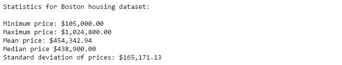
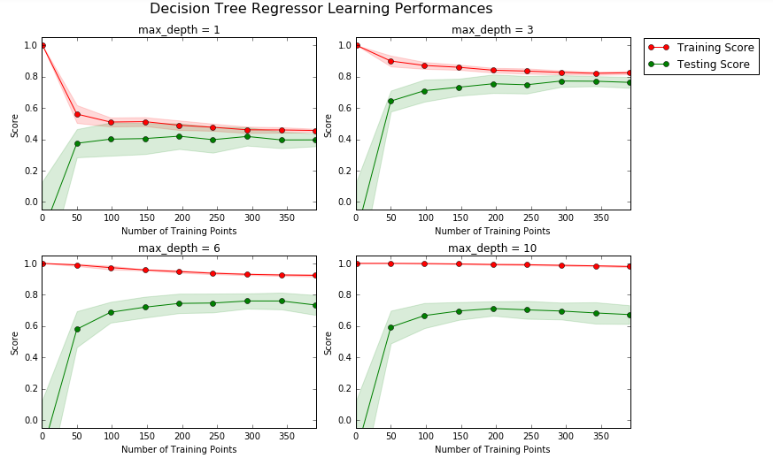
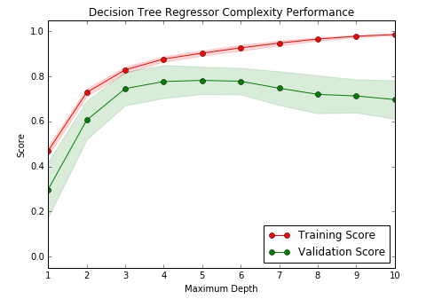

# Boston_Housing
This repository contains project files for ‘Project 1 - Boston Housing’ as part of Udacity's Machine Learning Nanodegree. The project can be viewed by opening 'boston_housing.html' in a web browser, or can be run interactively by opening 'boston_housing.ipynb' in a Jupyter Notebook.

In this project, I show some basic statistics of data collected from homes in suburbs of Boston, Massachusetts. I then evaluate the performance and predictive power of a model that has been trained and tested on this data. The model is used to make predictions of a home's monetary value. This kind of model would be useful to someone like a real estate agent on a daily basis, to help them make better business decisions.

Starter files provided by Udacity are in the 'Boston Housing Starter Files' folder. 

## Screenshots
Below are a couple screenshots showing features of this project.

## Installation
The installation documentation for the Jupyter platform can be found [here](https://jupyter.readthedocs.io/en/latest/install.html).
The documentation for advanced usage of Jupyter notebook can be found
[here](https://jupyter-notebook.readthedocs.io/en/latest/).

This project requires **Python 2.7** and the following Python libraries installed:

- [NumPy](http://www.numpy.org/)
- [Pandas](http://pandas.pydata.org)
- [matplotlib](http://matplotlib.org/)
- [scikit-learn](http://scikit-learn.org/stable/)

## Usage - Running Jupyter notebook

### Running in a local installation

Launch with:

    $ jupyter notebook
